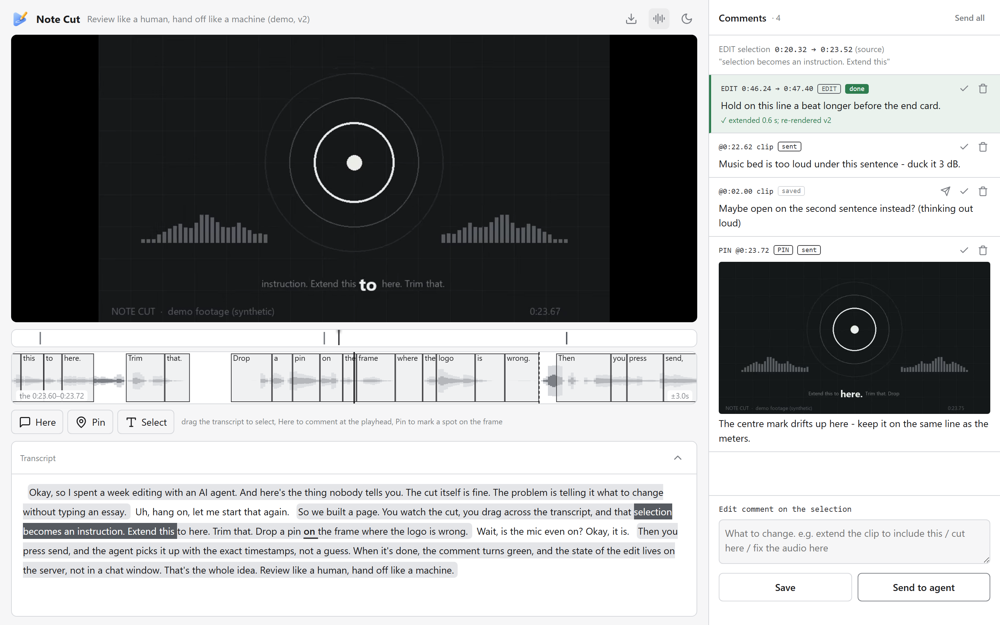
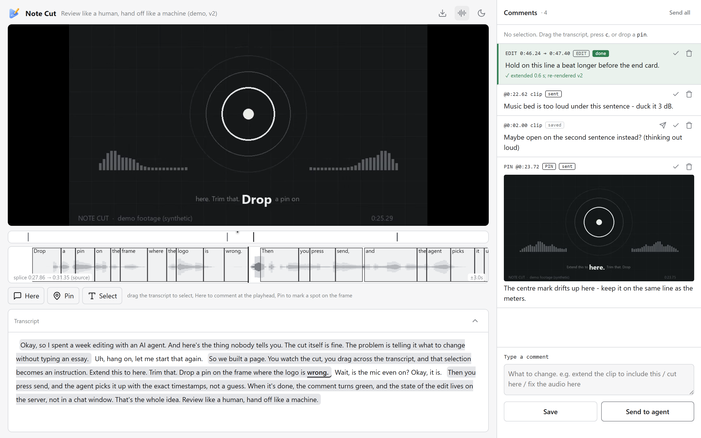
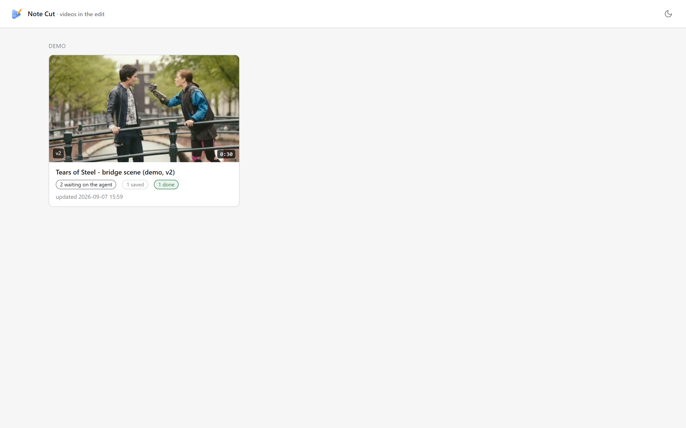
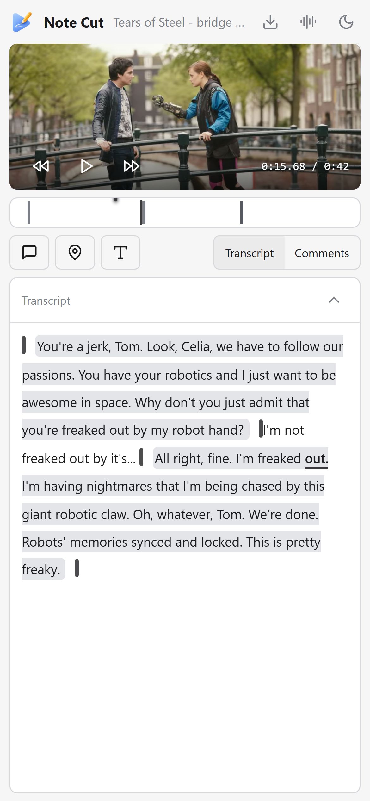
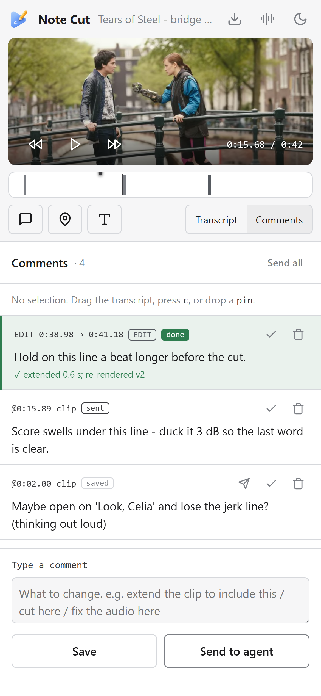

<p align="center">
  
</p>

<h1 align="center">Note Cut</h1>

<p align="center"><b>Review like a human. Hand off like a machine.</b></p>

<p align="center">
A single-file video review page for people, and an edit-state backend for AI agents.<br>
Watch the cut, drag across the transcript, drop a pin on a frame, press <i>Send</i>.<br>
The agent gets exact timestamps, does the work, marks it green, and writes the state of the edit back to the server — not into a chat window.
</p>

<p align="center">
  <code>pip install .</code> · <code>notecut demo</code> · Python 3.10+ · no dependencies · runs on a laptop, a NAS, or a $4 VPS
</p>

---



<table>
<tr>
<td width="50%"></td>
<td width="50%"></td>
</tr>
<tr>
<td align="center"><sub>Speech waveform strip — every cut is visible, labelled with its source timecode</sub></td>
<td align="center"><sub>Home — every video in the edit, with what is waiting on whom</sub></td>
</tr>
</table>

<p align="center">
  
  &nbsp;&nbsp;
  
</p>
<p align="center"><sub>Phone layout: tabs, icon toolbar, touch drag-select. Review from the couch.</sub></p>

---

## Why this exists

An AI agent can cut a video in minutes. Telling it *what to change* is the slow part: "the bit around the second sentence, no, a little earlier, extend it to where I say 'here'". Note Cut turns that into a click.

- **Every comment carries exact source timestamps.** Drag across the transcript and the selection *is* the instruction (`0:20.32 → 0:23.52`). Drop a pin and the agent gets the frame plus x/y.
- **Comments have a lifecycle.** `saved` is your private draft (the agent never acts on it). `sent` is work. `done` turns green with the agent's note.
- **The state of the edit lives on the server**, not in a conversation. A fresh agent with zero context runs one command (`notecut handoff <id>`) and knows the current cut, what is open, and what was already done.
- **Nothing is ever overwritten.** Comments are an append-only ledger; state changes are logged; the source media is never modified.
- **It is one Python file and one HTML file.** No database, no build step, no accounts, no JavaScript toolchain. `python -m notecut serve` and it is up.

## Quickstart (humans)

```bash
git clone https://github.com/Cookiebubba/notecut
cd notecut
pip install .          # stdlib only; add [asr] for local transcription, [fast] for numpy peaks
notecut demo           # unpacks the bundled sample into ./notecut-demo and serves it
```

Open <http://127.0.0.1:8808/v/demo>. That is the page in the screenshots: a 49-second synthetic clip with a real word-timed transcript, a cut, a done comment, two open ones and a pin.

To review your own footage:

```bash
notecut init myproject && cd myproject
notecut add first-cut --media /path/to/cut_v1.mp4 --title "Episode 12 — first cut"
notecut serve                     # http://127.0.0.1:8808/v/first-cut
```

`add` builds a 720p fast-start proxy, a hover sprite sheet and a waveform peaks file with **ffmpeg** (on your PATH). Without ffmpeg, pass `--no-prep` and the file is served as-is. For the transcript + word boxes:

```bash
pip install ".[asr]"              # faster-whisper; uses CUDA when available, CPU otherwise
notecut transcribe first-cut      # writes assets/first-cut/words.json and links it in notecut.json
```

Then, in the browser:

| Want to… | Do this |
|---|---|
| Comment on a moment | Press **Here** (or `c`) — a comment at the playhead |
| Ask for a re-cut | **Drag across the transcript** (phone: tap **Select** first), type what to change |
| Mark a spot on the frame | **Pin**, then click the frame — the agent gets the frame grab plus x/y |
| Keep a thought to yourself | **Save** — status `saved`, agents never act on it |
| Give it to the agent | **Send to agent** (or **Send all**) — status `sent` |
| See where a cut lands | `w` toggles the speech waveform strip; cuts are dashed lines with source timecodes |
| Jump around | Click any word; `space`/`k` play-pause; `j`/`l` ±10 s; `←`/`→` ±5 s; `,`/`.` one frame; timeline ticks are comments |
| Submit from the keyboard | `Ctrl+Enter` sends, `Ctrl+S` saves, `Esc` leaves the box |
| Get the file | Download icon in the header (the served proxy) |
| Share it | `notecut url <id>` prints the link |

## Quickstart (agents)

Point the client at the server and read the brief. Everything an agent needs is in [`AGENTS.md`](AGENTS.md); the short version:

```bash
export NOTECUT_URL=http://127.0.0.1:8808     # wherever `notecut serve` runs
export NOTECUT_BY=my-agent                   # name recorded on everything you write

notecut videos                                # what is on the server
notecut handoff first-cut                     # Markdown brief: current cut, open work, history
notecut comments first-cut --open --json      # the `sent` rows: exact timestamps, kind, text
# ... do the work ...
notecut complete first-cut c0007 "extended to 0:23.52, re-rendered v3"
notecut state merge first-cut '{"renders":{"current":{"file":"renders/v3.mp4","version":"v3"}}}' --note "v3 after c0007"
notecut log first-cut "v3 rendered; c0007 done; music duck on c0005 still open"
```

Comment statuses, in one line: **`saved` = never act. `sent` = your work. `done` = you wrote a note and it turned green.**

## How it fits together

```
your-project/
├── notecut.json            videos the server knows about (hot-reloaded on change)
├── assets/<id>/            proxy, sprite, peaks, words.json, edl.json  (derived; rebuildable)
├── data/<id>/
│   ├── comments.jsonl      APPEND-ONLY ledger of comments and operations
│   ├── state.json          the state of the edit (agents own this; any JSON)
│   ├── state_log.jsonl     one line per state write: who, when, which keys, why
│   └── pins/cNNNN.jpg      frame grabs for pin comments
├── data/feed.jsonl         every `sent` comment across all videos, for watchers
└── logo.png                optional: replaces the bundled logo in the header
```

`notecut serve --root your-project` (or `NOTECUT_ROOT=…`). The server is a Python `ThreadingHTTPServer`; media is served with HTTP Range so seeking works; JSON payloads are gzipped; the config is re-read when its mtime changes, so `notecut add` is live without a restart.

### `notecut.json`

```json
{
  "videos": {
    "first-cut": {
      "title": "Episode 12 — first cut",
      "group": "Episode 12",
      "media": "assets/first-cut/preview.mp4",
      "source": "/footage/ep12/cut_v1.mp4",
      "transcript": "assets/first-cut/words.json",
      "edl": "assets/first-cut/edl.json",
      "prior_edl": "assets/first-cut/prior_edl.json",
      "sprite": "assets/first-cut/thumbs.jpg",
      "peaks": "assets/first-cut/peaks.json",
      "poster": "assets/first-cut/poster.jpg",
      "section_start": 0.0,
      "duration": 612.4,
      "sprite_interval": 4, "sprite_cols": 20, "sprite_tw": 160, "sprite_th": 90
    }
  }
}
```

Only `media` is required. Relative paths resolve against the project root. Ids match `[A-Za-z0-9_-]+`.

| Key | What it is |
|---|---|
| `transcript` | `{"words":[{"w":"Okay,","s":0.31,"e":0.58}, …]}` — **source** timestamps (Whisper word output). Without it there is no transcript, drag-select or word boxes; everything else works. |
| `edl` | `{"keep":[{"start":s,"end":e}, …]}` — which source spans are in the current cut, in order. Words outside a kept span render as *cut* (grey, no background). Without it the whole file is treated as kept. |
| `prior_edl` | The EDL the *previous* render used. Comments made on an older render are remapped through it so they still point at the right moment on the current one (`cur_t`). |
| `section_start` | Offset added to displayed source timecodes when the media is a section of a longer master. |
| `peaks` | `{"hz":50,"n":…,"peak":[0-255…],"rms":[0-255…]}` — drives the waveform strip. |
| `sprite` + `sprite_*` | Hover thumbnails; one JPEG grid. |

### Comment ledger — `data/<id>/comments.jsonl`

Append-only. The server folds it into one row per live comment (`/api/<id>/comments`); nobody parses it by hand.

```jsonl
{"kind":"transcript","id":"c0001","i0":132,"i1":135,"src_start":46.24,"src_end":47.4,"sel":"Review like a human,","body":"Hold on this line a beat longer.","sent":true,"at":"…"}
{"kind":"point","id":"c0002","clip_t":22.62,"body":"Music bed is too loud here - duck it 3 dB.","sent":true,"at":"…"}
{"kind":"pin","id":"c0004","clip_t":23.72,"x":0.5,"y":0.44,"shot":"pins/c0004.jpg","body":"Centre mark drifts up.","sent":false,"at":"…"}
{"kind":"send","ref":"c0004","at":"…"}
{"kind":"complete","ref":"c0001","done":true,"by":"editor-agent","note":"extended 0.6 s; re-rendered v2","at":"…"}
{"kind":"resolve","ref":"c0003","resolved":true,"at":"…"}
{"kind":"delete","ref":"c0009","at":"…"}
```

Folded row: `{id, kind, status: saved|sent|done, body, at, cur_t, resolved, done_note, done_at}` plus the kind's own fields (`clip_t`, `src_start`/`src_end`/`sel`, `x`/`y`/`shot`). `clip_t` is a time on the render the comment was made on; `cur_t` is that moment on the *current* render (remapped through `prior_edl` → `edl`); `src_*` are source timestamps and never move.

### State — `data/<id>/state.json`

Free-form JSON owned by agents. `POST /api/<id>/state` with `{"state":{…}}` replaces, `{"merge":{…}}` deep-merges; both stamp `updated_at`/`updated_by` and append a line to `state_log.jsonl`. The home page reads `renders.current.version` (or the file stem) for the version pill. A shape that has worked:

```json
{
  "renders":  {"current": {"file": "renders/v3.mp4", "version": "v3", "duration_s": 612.4}, "lineage": ["v1 first cut", "v2 c0001 applied", "v3 c0007"]},
  "timeline": {"edl": "assets/first-cut/edl.json", "keeps": 68},
  "audio":    {"chain": "demucs vocals → 2-pass loudnorm -16 LUFS"},
  "tools":    {"cutter": "build_edl.py --words words.snapped.json"},
  "log":      ["2026-09-06 v3 rendered; c0007 done"]
}
```

## HTTP API

| Method | Path | Returns |
|---|---|---|
| GET | `/` | Home page |
| GET | `/v/<id>` | Review page |
| GET | `/media/<id>` | The proxy, with Range support |
| GET | `/api/health` | `{ok, root, videos, time}` |
| GET | `/api/videos` | `{videos:[{id,title,state_updated,handoff}]}` |
| GET | `/api/<id>` | Full page payload (words with cut positions, splices, peaks, comments, state) |
| GET | `/api/<id>/comments` | `{comments:[folded rows]}` |
| GET | `/api/<id>/state` | `{state}` |
| GET | `/api/<id>/handoff` | Markdown brief (`text/markdown`) |
| GET | `/api/feed?since=N` | `{total, since, items}` — every sent comment, all videos |
| GET | `/pins/<id>/cNNNN.jpg`, `/thumbs/<id>.jpg`, `/peaks/<id>.json`, `/poster/<id>`, `/logo.png` | Assets |
| POST | `/api/<id>/comment` | `{kind: point\|transcript\|pin, body, notify, clip_t \| src_start,src_end,sel \| clip_t,x,y,shot}` → `{comment}`; `notify:true` = send now |
| POST | `/api/<id>/send`, `/send_all` | `{ref}` — status → `sent`, appended to the feed |
| POST | `/api/<id>/complete` | `{ref, done, by, note}` — status → `done` |
| POST | `/api/<id>/resolve`, `/delete` | `{ref, resolved}` / `{ref}` |
| POST | `/api/<id>/state` | `{state:{…}}` or `{merge:{…}}`, optional `by`, `note` |

Every write is a JSON body; every response is JSON except the two HTML pages and the handoff. There is no auth (see below).

## CLI

```
notecut init [dir]                       create a project directory
notecut serve [--root R] [--host 0.0.0.0] [--port 8808]
notecut add <id> --media F [--title T] [--transcript W] [--edl E] [--prior-edl P]
                 [--group G] [--section-start S] [--copy-media] [--no-prep] [--height 720]
notecut prep <id> [--height 720]         rebuild proxy / sprite / peaks
notecut transcribe <id> [--model large-v3-turbo] [--device auto|cuda|cpu] [--language en]
notecut demo [--dir ./notecut-demo] [--host 127.0.0.1] [--port 8808]

# client (env NOTECUT_URL, default http://127.0.0.1:8808; NOTECUT_BY names the writer)
notecut videos
notecut handoff <id>
notecut comments <id> [--open] [--json]
notecut state get|set|merge <id> [json-or-@file] [--note N]
notecut complete <id> <cNNNN> [note...]
notecut log <id> <text...>
notecut watch [--since N] [--interval 2] [--once]
notecut url <id>
```

`python -m notecut …` works without installing.

## Deploying for real

Note Cut has **no authentication**. Bind it to something private:

- `notecut serve --host 127.0.0.1` and reach it through an SSH tunnel, or
- run it on a [Tailscale](https://tailscale.com) node and bind to the tailnet address — phones on the tailnet can open it directly, or
- put it behind a reverse proxy that does auth (Caddy + basic auth, Cloudflare Access, …).

A systemd unit is in [`deploy/notecut.service`](deploy/notecut.service). Point it at your project, `systemctl enable --now notecut`, done. The server logs one line per request to stdout.

Keep `data/` on backed-up storage: it is the only thing that is not rebuildable. `assets/` comes back with `notecut prep`.

## Development

```bash
pip install -e ".[dev]"
pytest                                  # ledger fold, state, handoff, range serving, hot reload, feed
python scripts/build_demo.py            # regenerate the demo (needs ffmpeg, kokoro-onnx, faster-whisper, PIL)
node scripts/screenshots.js             # regenerate README screenshots (headless Chrome)
```

`notecut/server.py` is the whole backend; `notecut/static/player.html` and `home.html` are the whole frontend. Read [`AGENTS.md`](AGENTS.md) before pointing an agent at a live project.

## License

MIT — see [LICENSE](LICENSE). The logo is part of the project and ships under the same terms.
